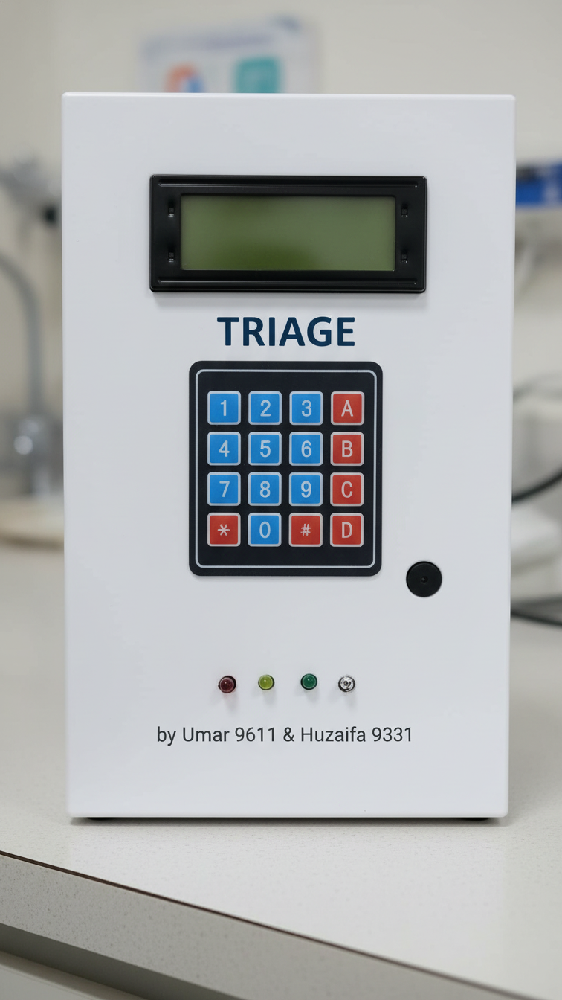

# 🚑 Triage Machine — Emergency Room Patient Priority System

**A hardware-based simulation of hospital triage, built to demonstrate real-world applications of Data Structures & Algorithms (DSA).**

<p align="center">
  
</p>

<p align="center">
  
  
  
  
</p>

---

## 📖 Overview

Emergency Rooms (ERs) frequently face overcrowding, forcing doctors to juggle patients with wildly different levels of urgency — often with no structured way to decide who gets treated first. When treatment is delayed past the *golden hour*, the consequences can be permanent injury or death.

**Triage Machine** is a physical, keypad-operated device that solves this problem by classifying incoming patients into priority categories and serving them strictly in order of medical urgency — never by arrival time alone. It was built as the final project for a **Data Structures and Algorithms** course to demonstrate that DSA isn't just theory — it can directly power a life-critical system.

> Built by **Umar Khan (Reg. No. 9611)** — lead developer, and **Huzaifa Masood (Reg. No. 9331)** — assisted with the classroom presentation.

---

## 🎯 Objectives

- Design a triage system that prioritizes patients based on medical severity, not arrival time
- Apply core DSA concepts — **queues**, in a real, physical, real-time embedded system
- Give hospital staff a fast, low-friction way to register and serve patients under pressure
- Reduce decision fatigue and confusion for doctors during overcrowding
- Demonstrate how efficient data handling can directly improve emergency outcomes

---

## 🩺 How Triage Classification Works

Every patient entered into the system is assigned to one of four priority phases:

| Phase | Category | Meaning | LED Indicator |
|:-----:|----------|---------|:--------------:|
| 1 | 🔴 **RED — Critical** | Immediate, life-threatening — attention required in seconds | Red LED |
| 2 | 🟡 **YELLOW — Urgent** | Serious, but stable enough to wait a short while | Yellow LED |
| 3 | 🟢 **GREEN — Minor** | Non-urgent, can safely wait | Green LED |
| 0 | ⚪ **DEAD — Unresponsive** | No response possible | Dead LED |

Patients are always served in strict priority order: **RED → YELLOW → GREEN → DEAD**, and within each category, on a **First-In-First-Out (FIFO)** basis — the core behavior of a **queue** data structure.

---

## ⚙️ How It Works

1. **Add a Patient** — the operator enters a unique Medical Record (MR) number on the keypad and assigns it a triage level.
2. **Enqueue** — the patient's MR number is pushed into the queue matching their priority level.
3. **Serve Next** — pressing the "serve" key dequeues the next patient, always checking RED before YELLOW, YELLOW before GREEN, and so on.
4. **Live Status** — the LCD displays live counts for every queue and previews who's next; LEDs light up to show which queues are currently active.
5. **Reset** — all queues can be cleared at once, with a confirmation prompt to prevent accidental data loss.

Every action is confirmed with a distinct buzzer pattern, so the operator gets audible feedback without needing to look at the screen.

---

## 🧠 Data Structure: The Circular Queue

At the heart of the system is a **circular queue**, implemented from scratch using a fixed-size array with `head`, `tail`, and `count` pointers — no dynamic memory allocation, which keeps it fast and safe on constrained embedded hardware.

Four independent queue instances — one per triage level — allow the system to:

- **Enqueue (`qPush`)** a new patient in O(1) time, with overflow protection once a queue is full
- **Dequeue (`qPop`)** the longest-waiting patient in a category in O(1) time, with underflow protection when empty
- **Peek (`qPeek`)** the next patient without removing them, used to preview the queue on the LCD
- Wrap indices around the array bounds automatically, so memory is reused efficiently instead of shifting elements

This mirrors exactly how a real hospital's intake system should behave: patients within the same severity level are treated fairly and in order, while higher-severity queues always take precedence.

---

## 🛠️ Hardware Components

| Component | Qty | Connected To | Purpose |
|---|:---:|---|---|
| **Arduino Nano** | 1 | — | Main microcontroller running the logic |
| **I2C 20x4 LCD** | 1 | I2C (SDA/SCL), address `0x27` | Displays menus, queue status, and patient info |
| **4x4 Matrix Keypad** | 1 | Rows → `3, 4, 5, 6` · Cols → `7, 8, 9, 10` | Operator input — entering MR numbers and selecting triage levels |
| **LED — Red** | 1 | `A0` | Lit when the RED (Critical) queue has patients |
| **LED — Yellow** | 1 | `A1` | Lit when the YELLOW (Urgent) queue has patients |
| **LED — Green** | 1 | `A2` | Lit when the GREEN (Minor) queue has patients |
| **LED — Dead** | 1 | `A3` | Lit when the DEAD queue has patients |
| **Buzzer** | 1 | `2` | Audible feedback for keypresses, confirmations, and alerts |
| **Breadboard** | 1 | — | Prototyping and circuit assembly |
| **Jumper Wires** | ~30 | — | Wiring between components |
| **220Ω Resistors** | 4 | In series with each LED | Current-limiting for the LEDs |
| **USB Cable / 5V Power Supply** | 1 | — | Powers the Arduino Nano |

> 📄 A full parts list with specifications is provided in [`RequiredHardware.txt`](./RequiredHardware.txt).

<p align="center">
  
</p>

---

## 🎮 Operator Controls

| Key | Action |
|:---:|--------|
| **A** | Add a new patient (enter MR number → select triage level) |
| **B** | Serve the next patient in priority order |
| **C** | View live queue counts and the next patient in line |
| **D** | Clear all queues (with confirmation) |
| **0–9** | Enter digits of the MR number |
| **#** | Confirm / OK |
| **\*** | Cancel / go back |

---

## 📂 Project Structure

```
Triage-Machine/
├── TriageMachine.ino          # Main Arduino sketch — all logic lives here
├── Triage.png                 # Photo of the finished prototype
├── RequiredHardware.txt       # Full parts list & specifications
├── Triage_Synopsis.docx       # Project synopsis (title, objectives, methodology)
├── Triage_Report.docx         # Full project report
├── Triage_Presentation.pdf    # Presentation slides (PDF)
├── Triage_Presentation.pptx   # Presentation slides (editable)
└── README.md                  # You're here
```

## 📚 Documentation

| Document | Description |
|---|---|
| [`Triage_Synopsis.docx`](./Triage_Synopsis.docx) | Project title, introduction, problem statement, objectives, and methodology |
| [`Triage_Report.docx`](./Triage_Report.docx) | Complete project report covering design, data structures, algorithm, and conclusion |
| [`Triage_Presentation.pdf`](./Triage_Presentation.pdf) | Classroom presentation slides (PDF) |
| [`Triage_Presentation.pptx`](./Triage_Presentation.pptx) | Classroom presentation slides (editable PowerPoint) |
| [`RequiredHardware.txt`](./RequiredHardware.txt) | Detailed hardware/parts list with specifications |

---

## 🚀 Getting Started

### Requirements

- Arduino IDE (or PlatformIO)
- Libraries: [`LiquidCrystal_I2C`](https://github.com/johnrickman/LiquidCrystal_I2C) and [`Keypad`](https://github.com/Chris--A/Keypad) (install via Library Manager)
- Arduino Nano (or any compatible board)

### Wiring Summary

- **LCD:** I2C — SDA/SCL to the board's I2C pins (default address `0x27`, change to `0x3F` if your module uses that)
- **Keypad rows:** pins `3, 4, 5, 6`
- **Keypad columns:** pins `7, 8, 9, 10`
- **LEDs:** Red → `A0`, Yellow → `A1`, Green → `A2`, Dead → `A3`
- **Buzzer:** pin `2`

### Upload

1. Clone this repository
2. Open `TriageMachine.ino` in the Arduino IDE
3. Install the required libraries listed above
4. Select your board and port, then upload
5. Power on — the LCD will greet you with the main menu

---

## 🔮 Future Enhancements

- Integration with real medical sensors (heart rate, SpO₂) for automated priority detection
- Persistent patient data storage and post-event analytics
- Wireless monitoring dashboard for hospital staff
- Tree-based sorting for arranging patients by combined severity and wait time

---

## 👥 Credits

| Name | Registration No. | Role |
|---|---|---|
| **Umar Khan** | 9611 | Lead Developer |
| **Huzaifa Masood** | 9331 | Classroom Presentation |

Built as the final project for the **Data Structures and Algorithms (DSA)** course.

---

## 📄 License

This project was created for academic purposes. Feel free to fork, learn from, and build on it — attribution is appreciated.
